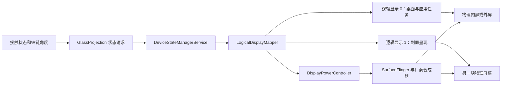

# 小米折叠屏双屏连续显示可行性报告

后续进展：限时原型已验证双向点亮和固定主屏的实时双屏动画，肉眼均确认没有闪黑；真正交换主屏的双向对照则复现了 OFF 和可见闪黑，详见 [双屏原型实测](DUAL-DISPLAY-TRIAL.zh-CN.md)。进一步的免 root 接口核查、补发 ON 实验和图层清空发现见 [免 root 连续切换补充研究](NO-ROOT-DISPLAY-CONTINUITY.zh-CN.md)。以下“尚未请求”等表述描述初始调研阶段的证据边界。

## 结论

**当前设备具备系统配置层面的双屏并发显示能力，现有 Shizuku shell 权限也具备请求这种状态的条件。要在保留原生桌面和应用交接的同时完全消除黑屏，不能仅把现有状态号替换为双屏状态号。** 固件在交换主屏对应的物理面板时，会明确要求参与切换的屏幕关闭，然后重新应用布局。这一机制位于系统显示服务，应用绘制的遮罩无法覆盖已经停止输出的物理屏幕。[本机证据 E1–E6]

建议分两步推进。先做一个独立、限时的 Shizuku 双屏呈现原型，验证另一块屏幕能否在已有内容准备好后点亮，同时保持原屏连续显示。若目标还包括在设定角度无黑屏地把正常桌面交给另一屏，则目前有代码依据的完整路线是系统显示服务参与的连续切换方案；需要系统扩展或系统进程内改造，并进一步确认厂商合成器和显示驱动的行为。

本报告的“可行”分为三个不同层次，不能混为一个承诺：

| 目标 | 当前判断 | 证据与剩余条件 |
| --- | --- | --- |
| 两块内置屏幕处于启用状态 | 固件明确支持 | 状态 5、6 均启用两块屏幕；尚未实际请求并验证物理发光 |
| 开合过程中两屏同时显示 GlassProjection 动画 | 有较强依据，适合先做原型 | shell 权限可用，需要双输出宿主、首帧准备和实机点亮验证 |
| 已亮屏保持显示，同时把新屏点亮 | 同主屏映射的状态转换有代码依据 | 例如 3→5、0→6；合成器、首帧、亮度时序仍需测量 |
| 正常桌面从外屏到内屏、再从内屏到外屏，全程没有黑屏 | 现有状态切换路径不能满足 | 5↔6 会交换逻辑屏幕映射，触发 OFF 等待；完整方案需改变系统切换路径 |
| 所有小米折叠机通用 | 尚无依据 | 本结论仅针对下述机型和固件，不能把状态号和能力直接推广 |

## 适用范围与证据等级

证据对应 2026-09-13 采集的 `lhasa`、型号 `2608BPX34C`、Android 17、HyperOS `OS4.0.11.0.XPNCNXM`。设备报告 `ro.soc.model=O3`、`ro.board.platform=xring_o3_asic`，`persist.sys.multi_display_type=3`，属于横向内折类别。工程基线为 GlassProjection `main` 提交 `b334a09914b51fed1a26acd3a84b1521bb84d7cf`，当前开发版 0.3.43。[E1、E2、E7]

本文优先采用本机运行时显示布局、权限和字段，其次采用同固件系统 JAR 中的方法实现，公开 Android 源码用于解释和交叉核对。公开源码的 `main` 分支不是该小米固件的源码版本，不能用它覆盖本机差异。反编译器对部分复杂条件生成了不完整的 Java；主屏切换的关键判断另以保留跳转的反编译结果核对，不把错误的资源常量别名或未初始化变量当成真实代码。[E3]

双屏状态本轮没有被主动切换；没有安装新应用版本、修改手机显示设置或写入系统分区。运行时探针只读取权限、资源、方法签名和 `DisplayInfo`。因此，以下结论属于**已验证的接口与实现条件**，不属于“双屏动画已经实测成功”。

## 显示架构：物理屏幕与逻辑屏幕是两件事

本机有两块独立内置显示设备：内屏物理尺寸为 1672×2364，外屏为 1168×1712。在当前展开姿态下，内屏旋转后向应用提供 2364×1672 的逻辑尺寸。系统还存在 GlassProjection 自建的虚拟捕获屏；它不是第三块物理面板，更不能证明内外屏同时亮起。[E1]

Android 的应用任务、窗口和显示上下文跟随逻辑 `displayId`；面板由物理地址识别。当前普通开合让 `displayId=0` 在内外两个面板之间转换，桌面继续留在逻辑主屏上，随后响应尺寸、旋转和配置变化。`displayId=1` 则对应另一个面板。因此，“内屏恒等于 0、外屏恒等于 1”是错误假设，双屏渲染必须在每次拓扑变化后重新识别物理目标。[E1、E3]



双屏配置中的 `leadDisplayAddress` 用于指定副屏跟随的主显示器；它不是“自动复制桌面”的声明。亮度联动、图层内容、触控路由也不等于同一个开关。当前副屏设备具有 `FLAG_OWN_CONTENT_ONLY`，应用不能依赖它自动出现与主屏相同的桌面。[E1、E3]

## 固件已配置的七种状态

运行时支持状态 0–6。设备状态定义位于 `/product/etc/devicestate/device_state_configuration.xml`，显示布局定义位于 `/odm/etc/displayconfig/display_layout_configuration.xml`。另外存在 ODM 的 GSI 设备状态配置，但它与产品配置不能混用；当前运行时确实包含产品配置中的全部七种状态。[E1、E2]

| 状态 | 名称 | 逻辑主屏 0 | 逻辑副屏 1 | 用途判断 |
| --- | --- | --- | --- | --- |
| 0 | CLOSED | 外屏启用 | 内屏关闭 | 普通合拢 |
| 1 | TENT | 外屏启用 | 内屏关闭 | 帐篷状态 |
| 2 | HALF_OPENED | 内屏启用 | 外屏关闭 | 普通半展开 |
| 3 | OPENED | 内屏启用 | 外屏关闭 | 普通展开 |
| 4 | OPENED_REVERSE | 外屏启用 | 内屏关闭 | 展开后使用外屏；不是双屏 |
| 5 | OPENED_PRESENTATION | 内屏启用 | 外屏启用，跟随主屏 | 内屏为主的双屏呈现 |
| 6 | OPENED_REVERSE_PRESENTATION | 外屏启用 | 内屏启用，跟随主屏 | 外屏为主的双屏呈现 |

“启用”描述布局目标，不代表本轮观察到该状态下两屏已经物理发光。状态 4、5、6 标记为 `PROPERTY_EMULATED_ONLY`，适合由状态请求进入，不能期待角度传感器自然产生它们。请求 5 或 6 也不应通过伪造基础物理状态实现；保留真实基础状态，才能继续处理接触闭合、方向改变和取消恢复。[E2、E3]

`DeviceStateToLayoutMap` 还支持从 `/data/system/displayconfig/display_layout_configuration.xml` 优先加载配置，随后才考虑 ODM 和 vendor。这个系统数据路径不是普通 shell 的配置入口，也不代表应用可热更新布局。增加或更改布局文件本身仍无法消除逻辑映射变化所触发的 OFF 等待。[E3]

## 权限和接口：哪些能用，哪些只是名字看起来相关

### DeviceStateManager 是首选入口

本机 UID 2000 的运行时权限检查返回 `PERMISSION_GRANTED`，包括 `CONTROL_DEVICE_STATE`、`MANAGE_DISPLAYS`、`ACCESS_SURFACE_FLINGER`、`INTERNAL_SYSTEM_WINDOW` 和 `CAPTURE_VIDEO_OUTPUT`。当前工程的 Shizuku 助手就是这一身份。这证明请求双屏状态所需的主要权限条件已经具备，不需要为了该项能力直接假设必须 root。[E2、E7]

本机 `DeviceStateManagerService` 的调用链为：

1. `BinderService.requestState()` 进行调用者权限检查。
2. `requestStateInternal()` 要求请求进程已注册回调，检查目标状态是否支持，建立带 Binder token 的覆盖请求。
3. 支持控制设备状态的调用者无需走普通前台应用的可请求状态限制；相关教育弹窗路径也有权限分支。
4. 状态提交后显示服务应用对应布局，实际面板点亮继续由显示电源和合成器完成。

因此应复用工程已有的 `DeviceStateManagerGlobal.requestState()` 方式，并补齐请求生命周期回调，而不是硬编码 Binder transaction 编号。方法返回或 `onRequestActivated` 不能替代“两个面板已 ON、已呈现有效帧”的验收。[E2、E3、E7]

### Jetpack 的双屏接口不是本机现成入口

Android 提供 `WindowAreaController` 和 `presentContentOnWindowArea()`，用于支持设备上的双屏呈现；它依赖厂商提供相应 WindowManager Extensions 能力，不能仅根据 Android 版本判断。[Android 官方双屏指南](https://developer.android.com/develop/ui/compose/layouts/adaptive/foldables/support-foldable-display-modes)

本机资源中 `config_supportsConcurrentInternalDisplays=true`，但 `config_deviceStateConcurrentRearDisplay=-1`、`config_deviceStateRearDisplay=-1`，后屏物理地址资源为空。随固件的 `WindowAreaComponentImpl.getCurrentRearDisplayPresentationModeStatus()` 在并发状态标识为 -1 时返回不支持。因此，普通 Jetpack 路径与小米内部状态 5、6 的存在不是一回事；当前应走已授权 shell 的状态接口。[E2、E5；Android 的厂商配置要求见 [WindowManager Extensions](https://source.android.com/docs/core/display/windowmanager-extensions)]

运行时状态列表中的 `app_accessible=true` 也不等于后台普通应用可以随意请求。服务还检查前台身份、允许请求的状态或控制权限；不能据此把 Shizuku 去掉。[E1、E3]

### 其他候选接口的实际边界

| 入口 | 本机证据 | 对本目标的意义 |
| --- | --- | --- |
| `IDisplayManager.enableConnectedDisplay()` | 方法存在；本机实现可对非外接的逻辑显示调用 `setDisplayEnabledLocked()` | 可作为单独点亮副屏的对照实验，但下一次布局应用可能覆盖启用位；没有解决主屏映射和退出恢复 |
| `IDisplayManager.requestDisplayPower()` | 方法存在，直接调用显示设备的电源请求 | 不改变任务归属或布局；亮度沿用缓存，关闭屏幕的缓存亮度不一定适合直接开启；没有持久租约机制 |
| `SurfaceControl.setDisplayPowerMode()` | 本机反射可见，shell 有相关权限 | 只能作为底层研究入口；Java 方法存在不证明每个 native 调用都允许，也不提供窗口连续性和服务状态一致性 |
| `IMiuiMultiDisplayManager.setDisplayStateIgnoreFold()` | 接口声明存在于 `miui-framework.jar` | 已检查服务列表和所取核心 JAR，未发现可确认的服务端实现或可调用服务。不能把接口名当成可用的无黑屏开关 |
| 小米“预亮屏”逻辑 | `DisplayPowerController.setPowerMode()` 与 `mIsEarlyDisplayOn` | 代码明确以“不处于切换中”为条件；不绕过当前主屏交换的切换限制 |
| `displayfeature` 与厂商显示扩展服务 | 本机存在，已读取显示特性服务状态 | 不能仅凭名称推断具有桌面交接 API；当前没有验证到满足本目标的接口 |
| `Presentation` / 无障碍显示覆盖层 | Android 有相应呈现入口；工程已有覆盖层宿主 | 解决显示内容，不负责启用物理面板或把普通应用任务移到副屏 |

这里需要保留一个本机差异：`enableConnectedDisplay()` 不能简单按“仅支持 HDMI 外屏”排除。该固件会对非外接显示走逻辑启用路径。不过它不带本项目需要的退出恢复和原子交接机制，所以优先级仍低于厂商预设双屏状态。[E3]

小米公开的 Flip 适配文档主要描述设备类型识别、应用连续性与布局适配。`MiuiMultiDisplayTypeInfo` 能识别折叠形态，不是同时点亮两屏的接口；该 Flip 文档也不是此款横折设备的驱动契约。[小米官方适配文档](https://dev.mi.com/xiaomihyperos/documentation/detail?pId=2026)

## 黑屏根因：切换策略主动关闭显示

本机 `LogicalDisplayMapper.resetLayoutLocked()` 按以下条件判断显示是否进入切换过程：已有切换标记、启用状态变化、物理面板对应的逻辑 ID 变化，或面板只存在于一个布局。关键映射变化条件与公开 AOSP 实现一致。[E3；[AOSP LogicalDisplayMapper](https://android.googlesource.com/platform/frameworks/base/+/refs/heads/main/services/core/java/com/android/server/display/LogicalDisplayMapper.java)]

随后 `DisplayStateController.updateDisplayState()` 将处于切换中的显示目标状态设为 OFF；`areAllTransitioningDisplaysOffLocked()` 等待相关设备报告 OFF。条件满足后才进入 `transitionToPendingStateLocked()`，调用 `applyLayoutLocked()`，必要时执行 `swapDisplaysLocked()`。窗口策略还会收到 `onDisplaySwitchStart()`。[E3]

因此要按转换边分析，而不是只看转换终点：

| 转换 | 原主屏映射是否保留 | 框架层面的判断 |
| --- | --- | --- |
| 0→6 | 外屏仍为逻辑 0 | 原外屏没有因这次映射变化而必须关闭；待开启内屏参与启用变化 |
| 3→5 或 2→5 | 内屏仍为逻辑 0 | 原内屏没有因这次映射变化而必须关闭；待开启外屏参与启用变化 |
| 6→0 | 外屏仍为逻辑 0 | 可以结束同侧主屏的呈现会话，关闭内屏；仍需实机核对策略 |
| 5→3 或 5→2 | 内屏仍为逻辑 0 | 可以结束同侧主屏的呈现会话，关闭外屏；仍需实机核对策略 |
| 5↔6 | 两块面板都交换逻辑 ID | 两屏均满足切换判定，仍会经过关闭等待 |
| 6→3、5→0 | 主屏换到另一个面板 | 双屏会话结束时依然触发映射交换，不能把黑屏问题藏到退出步骤 |

前四行是局部框架条件分析，不是对整条硬件链的零黑帧保证。新面板从 OFF 开始本来就存在电气启动时间；目标应是已有面板持续呈现、另一面板亮起即有正确内容，避免额外的“亮—黑—再亮”和空白首帧。

本机还存在两个有关联但不能替代根因修复的厂商机制。`MiuiFoldPolicy` 会依据合拢设置决定保持亮屏、提示上滑或休眠；当前读取到 `close_lid_display_setting=2`，但应用不能依赖所有用户都这样设置。`DisplayRotationStubImpl` 则保存、恢复内外屏不同旋转模式，实机窗口历史也有 `DoubleSwitch#Inner` 和 `DoubleSwitch#Outer`，解释了主屏尺寸改变之外的后续布局跳动。[E4、E6]

另有 `DualScreenCoverManager`，但其初始化被 `isIndependentRearDevice()` 限制；本机设备类型是 3，不是该分支要求的 6。它不应被误认成横折手机双屏黑屏的现成修复点。[E2、E4、E5]

## 副屏为何不能直接当第二个完整桌面

运行时探针读到 `display0.canHostTasks=true`、`display1.canHostTasks=false`。对应的 `LogicalDisplay.validateCanHostTasksLocked()` 明确对折叠/Flip 设备的非主内置屏返回 false。WindowManager 据此处理系统装饰和显示内容模式；这比普通“应用未声明支持多窗口”的限制更靠下。[E2、E3]

这并不否定副屏显示 `Presentation` 或图形覆盖层的可能性。它意味着“保持状态 5 或 6，再用 launchDisplayId 把现有桌面移到副屏”不能作为当前设备上已成立的方案。即使把副屏填满一张桌面镜像，原应用任务和正常触控也仍然归属于逻辑主屏。

通过虚拟显示运行桌面、再向两块物理屏输出并重映射输入，是另一种较大的系统替代架构。它会牵涉启动器、锁屏、任务路由、输入法、通知栏、受保护画面和不同屏幕尺寸，已超出一次开合特效的改动范围，也没有证据表明能够透明覆盖所有系统场景。不建议把它作为本项目当前主线。

## 方案比较

| 方案 | 权限/改动 | 双屏动画 | 原生主屏无黑屏交接 | 建议 |
| --- | --- | --- | --- | --- |
| 单屏 0/2 加黑色淡入淡出 | 当前实现 | 否 | 否 | 保留为兼容回退 |
| 按进入方向选择 5 或 6，固定主屏 | 现有 Shizuku；新增双渲染输出 | 值得验证 | 不能单独解决会话结束后的异侧主屏接管 | 优先原型，明确其验证范围 |
| 动画期间直接 5↔6 | 现有 Shizuku | 两端支持 | 当前框架路径仍关闭两屏 | 不作为零黑屏方案 |
| 启用副屏或直接设置面板 ON | shell 可见部分入口 | 需额外提供内容 | 会与布局、电源、亮度和窗口策略冲突 | 限定为诊断对照，不能靠反复写 ON 量产 |
| 普通 Jetpack 双屏呈现 | 普通应用 | 本机标准资源未启用 | 不解决系统桌面全局交接 | 不作为本机主入口 |
| 系统服务参与的连续映射切换 | OEM 系统扩展，或有相应能力的系统进程内修改 | 可以设计实现 | 当前最有依据的完整工程路线，仍需硬件验证 | 满足严格目标时推进 |
| 固定双屏拓扑并改任务/输入策略 | 大范围系统改造 | 可以设计实现 | 潜力存在，兼容代价最大 | 暂不优先 |

root 本身不是“调用一个函数就无缝”的能力；需要在系统内部改变具体切换策略。反过来，也不能声称闭源固件中绝不存在其他 OEM 专用入口。本报告给出的是已读核心实现支持的路线及明确尚未证实的部分。

## 第一阶段：Shizuku 双屏呈现原型

原型只回答三个问题：另一屏是否能亮、亮起时能否直接显示已准备内容、原屏是否连续。它不把推迟到会话结束的黑屏包装成问题已解决。

**状态与生命周期。** 保持真实基础状态和接触传感器判断。从外屏主屏出发试验 0→6，从内屏主屏出发试验 3→5；首轮在中间角度静止，不跨终点，不同时启用旧的 0/2 控制器。覆盖请求由单一控制器持有，使用状态回调、独立超时和显式取消。请求被相机或其他功能取代时退出，不争抢或自动无限重试。[E2、E3、E7]

进程死亡恢复不能泛化为所有固件都自动可靠：本机 `OverrideRequestController` 还存在 sticky request 和按请求 flags 取消的逻辑。应检查实际支持状态的属性，测量控制进程退出后的恢复，并保证本项目自身的租约超时会取消请求。不要使用修改基础物理状态来强行维持双屏。[E3]

**内容准备。** 为两个显示分别持有 `SurfaceControlViewHost`、输出 Surface、几何信息和 owner token。Android 的无障碍显示覆盖层可以指定显示并支持多个覆盖层；当前工程已使用该入口，但一个 SurfaceControl 改挂另一个显示只是迁移，不会自动成为两个独立输出。副屏是否允许在关闭期间预建并成功提交有效 buffer，需要本机验证。[E7；[AccessibilityService API](https://developer.android.com/reference/android/accessibilityservice/AccessibilityService#attachAccessibilityOverlayToDisplay(int,%20android.view.SurfaceControl))]

GPU 输入优先共享一份当前主屏内容和模糊金字塔，双输出分别执行内、外屏投影。先为待亮屏提交有效画面，再请求其启用。首帧允许从上一有效源帧生成，但必须记录帧年龄，并在锁屏变化或授权失效时立即丢弃，避免旧桌面残影。第二屏不能以透明清晰区依赖不存在的原生桌面，应由渲染器合成完整输出。

两块屏幕不同的宽高比、旋转和裁切方向必须分别计算。现有外屏左对齐、内屏相反的裁切约定，以及中轴线模糊向另一半延伸的参数可以保留；不能让一个全局 `primaryInner` 同时承担捕获源、输出目标和系统主屏三种含义。[E7]

**避免自我捕获。** 所有输出层都必须验证不会进入输入镜像，包含双屏输出和可能的快照层；否则会形成递归镜像。若两个目标只是同一源帧的不同投影，不应重复进行两套全分辨率捕获和模糊金字塔。双输出的增量 GPU 时间、内存与刷新率必须实测，不能据“两屏都支持 120 Hz”推断双屏动画也能稳定 120 fps。[E1、E4、E7]

**进入、退出条件。** 等待“状态激活、两块物理显示的 state/committedState、输出有效帧”三个条件，而非固定等待若干毫秒。若失败，回到原有单屏路径。同一主屏的会话可以按 6→0 或 5→3 验证退出；跨侧的 6→3 和 5→0 单列为第二阶段问题，不隐瞒其切换成本。

## 第二阶段：完整无黑屏交接的系统方案

推荐的系统方向是**保留 Android 正常任务迁移语义，但让已准备内容的双屏切换使用专门的连续呈现路径**。仍然允许逻辑主屏随开合变化，避免为每个应用重建一套桌面和输入体系。需要系统同时协调下面四件事，而不是全局跳过 OFF。[E3、E4]

第一，增加严格限定的双屏切换会话。仅在本机确认支持的两块内置屏、有效应用租约、两个输出均已准备且系统处于可交互状态时进入。现有热限制、真正休眠、屏幕关闭、近距离保护和用户锁屏等路径继续优先处理；普通显示切换不能被无条件改变。

第二，修改 `LogicalDisplayMapper` 与电源控制协作。连续路径需要把“逻辑内容要迁移”和“物理面板必须关闭”分离：不能一边阻止 OFF，一边仍等 `areAllTransitioningDisplaysOffLocked()`，否则会等到超时。应以两个输出的呈现完成信号和所需事务完成条件替代该会话中的关屏屏障，同时检查本机针对副屏 ADDED 事件和硬件关闭状态的特殊处理。只改一个布尔判断不足以保证完成切换。[E3]

第三，在重映射期间让每块物理屏仍有自己的有效内容。当前覆盖层附着逻辑显示，映射交换后可能随逻辑主屏移动，不能天然充当物理屏持续显示层。系统需在映射更新、图层栈调整和覆盖层归属变更之间保持明确顺序；必要时为每块物理屏保留短暂独立的动画帧或可信快照。待目标原生窗口以新尺寸、旋转完成绘制后，在下一次可呈现事务中逐渐揭示它，源屏再退出。这里保持的是画面连续，不是用黑色遮罩隐藏空白。

第四，验证窗口和触控同步。主屏任务、旋转、Insets、系统栏和输入视口需要在同一次交接中协调；必须测试目标屏第一下点击的坐标、输入法、锁屏和指纹/人脸状态。不应通过允许旧桌面一直显示来掩盖新锁屏，也不能仅凭 `onRequestActivated` 或应用一帧回调就放出尚未完成布局的原生内容。[E3、E4、E6]

实现形态优先是 OEM 提供的系统服务扩展；在可修改系统的开发设备上，也可评估精确匹配固件的方法修改或系统进程内模块。具体注入框架对 Android 17 和该机型的兼容性尚未验证，不能把某个现成 root 模块当作已经可用的依赖。即使框架层允许连续切换，若 XRing 合成器或驱动在活动显示迁移时强制复位，仍需向 native 层继续推进。

仅增加一种双屏 XML 布局、仅打开并发资源开关、仅修改 `canHostTasks`、仅关闭系统动画缩放，都不能同时解决上述四项。当前并发开关已经为 true；主屏映射交换的 OFF 屏障仍独立存在。[E2、E3]

## 对 GlassProjection 的具体改动边界

| 当前组件 | 原型阶段建议 | 完整方案额外需求 |
| --- | --- | --- |
| `EarlyDisplayModel` / `EarlyDisplayHelper` | 新增单独的双屏会话状态机；同主屏 5/6；回调、期限与取消 | 增加系统连续切换会话接口，避免旧控制器同时发 0/2 |
| `MirrorPreview` | 每个目标显示一个宿主和独立租约，读取物理目标身份 | 映射交换期间输出层归属与物理呈现保持一致 |
| `LiveMirrorWindowProbe` | 分离捕获源与输出目标，共享源纹理和模糊金字塔，双 EGL 输出 | 接入系统呈现/事务完成信号，不依赖电源关闭遮蔽布局 |
| provider 的 `mirror-lease` / `mirror-frame` | 按显示返回 Surface、几何、代际号、源帧时间 | 增加切换序号与各屏 ready/committed 确认 |
| `ScreenFade` / `CoverLayoutReady` | 保留单屏兼容路径；双屏原型不直接删除旧逻辑 | 新路径用有效画面承接，布局检测作为揭示条件 |
| `FoldPose` 与起步参数 | 保留已验证的接触闭合保护和现有观感默认值 | 角度与切换会话协调，但不再用同一阈值代表“开始预备”和“硬件已完成” |

用户设置的切换角度应最终表示“原生交互主屏切换的目标时刻”。预备另一屏输出发生在它之前；预备量需按实际亮屏延迟和角速度计算并限幅。起步只有 1° 时不能假设已经有充足时间完成冷启动，应允许明确的准备阶段，并测量快速开合的最坏情况。这是需要验证的调度设计，不是承诺固定提前多少度就一定无黑帧。

## 实机验证顺序与通过条件

| 阶段 | 动作 | 必须观察的结果 | 失败后的判断 |
| --- | --- | --- | --- |
| A：静态并发 | 静止姿态、限时请求 3→5；另一次请求 0→6 | 两块物理显示均 ON/committed ON，原主屏仍有连续输出，取消后恢复 | 接口、厂商策略或硬件限制；先查明，不继续叠加动画 |
| B：带首帧点亮 | 副屏预建输出、提交辨识图案，再请求同侧双屏 | 新屏第一次可见内容就是正确图案；原屏无灭屏 | 区分 buffer 未准备、窗口未挂载、亮度未就绪和面板启动 |
| C：双屏动画 | 慢开合、暂停、反向，保持当前主屏映射 | 两屏观感与裁切方向正确，无自捕获，帧率稳定 | 修渲染及会话状态，不据此更改物理基础状态 |
| D：原生交接对照 | 单独记录 5↔6、6→3、5→0 | 精确量出当前 OFF、布局重排和首帧时长 | 验证系统根因，不把黑屏移到终点就算通过 |
| E：连续路径 | 在支持系统改造的环境切换主屏 | 两屏在交接窗口内无 OFF/空白帧，原生窗口和输入正确恢复 | 若仍有物理空白，继续检查合成器与驱动；不得宣布完成 |
| F：恢复与兼容 | 助手退出、权限消失、熄屏、锁屏、相机双屏抢占、反向快速开合 | 覆盖请求和输出及时释放，不残留双亮、旧桌面或错误触控 | 不满足恢复条件不得默认开启 |

应同时记录角度、接触状态、基础/请求/提交状态、逻辑与物理映射、两屏 `state` 和 `committedState`、输出帧编号与源帧时间、窗口尺寸和旋转、事务完成时间。日志时间统一使用单调时钟。

仅截图不能验收“无黑屏”：截图可能排除本项目覆盖层，也不能证明物理背光/像素驱动在两个帧之间未关闭。需要同步系统 trace 与能同时看见两屏的外部高速录像。60 Hz 下每帧约 16.7 ms、120 Hz 下约 8.3 ms；最终报告应给出黑帧数量及首帧延迟的分布，而不是“感觉基本可以”。性能目标先由单屏基线决定，不编造已经测得的双屏 GPU 耗时。

## 公开源码与未解决的边界

小米官方 [MiCode 内核仓库](https://github.com/MiCode/Xiaomi_Kernel_OpenSource) 提供内核源码入口；本次对公开分支的查询未发现 `lhasa` 对应分支。内核仓库也不等于 HyperOS 的 Java 显示策略源码。不能用其他机型、其他 SoC 的面板驱动证明本机无缝双屏能力。[E8]

本机能够读到核心 framework JAR、状态与布局配置；XRing composer 可执行文件及相关 vendor 显示库的读取受到权限限制，未取得同版本 native 实现，也没有验证专有 Binder 调用。因此不能声称已经完整了解闭源显示驱动，更不能保证框架改完就不存在硬件级空白间隔。当前证据足以定位现有软件黑屏路径并设计下一步原型；完整交付还需上节实验。

最有价值的下一步是 A、B 两项：**先证明“保留当前主屏、让另一屏带内容点亮”**。通过后复用现有模糊和视差实现双屏渲染；同时将“异侧原生主屏零黑屏交接”作为独立系统任务。两者分开验收，才能判断瓶颈究竟在应用准备、系统映射还是厂商硬件链。

## 证据索引

本机原始证据保存在项目忽略目录 `build/diagnostics/dual-display-research/`，不包含在公开源码交付中。下列条目以文件名及方法定位；它们是同固件本地材料，不是公开小米源代码。报告没有分发系统 JAR 或反编译全文。

| 编号 | 材料 | 支持的主要结论 |
| --- | --- | --- |
| E1 | `display.txt` 的 Display Devices、Logical Displays、DeviceStateToLayoutMap；`device-state.txt`、`supported-states.txt` | 两块物理屏幕、逻辑映射、状态 0–6、双屏布局目标 |
| E2 | `device-identity.txt`、`runtime-probe.txt`、`shell-package.txt`、`firmware/product-device-state.xml`、`firmware/odm-device-state.xml`、`firmware/display-layout.xml` | 固件和设备类别、shell 实际权限、资源值、副屏任务能力、状态属性与布局 |
| E3 | `firmware/services.jar`；`DeviceStateManagerService`、`OverrideRequestController`、`LogicalDisplayMapper`、`LogicalDisplay`、`DisplayStateController`、`DisplayManagerService`、`DeviceStateToLayoutMap`、`DeviceStateProviderImpl` | 权限检查、请求取消、OFF 屏障、主屏交换、副屏限制、配置读取优先级 |
| E4 | `firmware/miui-services.jar`；`DeviceStateManagerServiceImpl`、`DisplayManagerServiceImpl`、`MiuiFoldPolicy`、`PowerManagerServiceImpl`、`FoldScreenListenerStubImpl`、`DisplayRotationStubImpl` | 小米合拢/反向状态策略、旋转恢复、独立背屏代码的适用范围 |
| E5 | `firmware/miui-framework.jar`、`firmware/window-extensions.jar`；`MiuiMultiDisplayTypeInfo`、`IMiuiMultiDisplayManager`、`WindowAreaComponentImpl` | 设备类型、接口声明与实际 Jetpack 能力的区别 |
| E6 | `window.txt`、`surfaceflinger.txt`、`services.txt`、`displayfeature.txt` | 窗口旋转记录、当前合成状态、已注册服务与显示特性服务状态 |
| E7 | 工程基线中的 `tools/helpers/EarlyDisplayHelper.java`、`EarlyDisplayModel.java`、`LiveMirrorWindowProbe.java`、`projection-lab/src/main/java/io/github/sixzleo/tabfold/projection/MirrorPreview.java` 等 | 当前单屏控制、捕获和输出结构、需要改造的组件 |
| E8 | `micode-branches.txt`，MiCode 官方仓库公开分支查询 | 未发现匹配 lhasa 分支的检索范围；不作全网不存在的断言 |

关键本机 JAR 的 SHA-256：

```text
services.jar          7ad88c20dac41c4a3bed6ad64552c2fcf00875c621abdc482c2386a5f5339f96
miui-services.jar     860f49bfffa81722505a4710a24877e7f61eff67aee596e8d9d90cc3857d9d2c
miui-framework.jar    f8d56e736743bcecc3c5ee4f240d7fca5c080fbd5965b6c53e2bd547ce3f1c55
window-extensions.jar c1d8f68013fdce07eb5a5b69e116523a4762dd7404bbfb87a4610fcde7c9e573
```

公开参考资料均于 2026-09-13 访问：

1. Android Developers，[Support foldable display modes](https://developer.android.com/develop/ui/compose/layouts/adaptive/foldables/support-foldable-display-modes)：标准后屏和双屏呈现接口、设备能力判断。
2. Android Open Source Project，[WindowManager Extensions module](https://source.android.com/docs/core/display/windowmanager-extensions)：厂商并发屏幕状态与资源配置；页面标注更新于 2026-07-16。
3. AOSP，[LogicalDisplayMapper.java，main](https://android.googlesource.com/platform/frameworks/base/+/refs/heads/main/services/core/java/com/android/server/display/LogicalDisplayMapper.java)：逻辑映射、切换判定和布局应用；作为交叉核对，不冒充本机源码。
4. Android Developers，[AccessibilityService.attachAccessibilityOverlayToDisplay](https://developer.android.com/reference/android/accessibilityservice/AccessibilityService#attachAccessibilityOverlayToDisplay(int,%20android.view.SurfaceControl))：按显示附着覆盖层，API 34 引入。
5. 小米澎湃 OS 开发者平台，[竖折手机（Flip）适配说明](https://dev.mi.com/xiaomihyperos/documentation/detail?pId=2026)：设备类型识别与应用连续性；页面标注更新于 2025-02-28，仅用于其明确适用的 API 背景。
6. MiCode，[Xiaomi_Kernel_OpenSource](https://github.com/MiCode/Xiaomi_Kernel_OpenSource)：小米官方内核源码发布入口。
