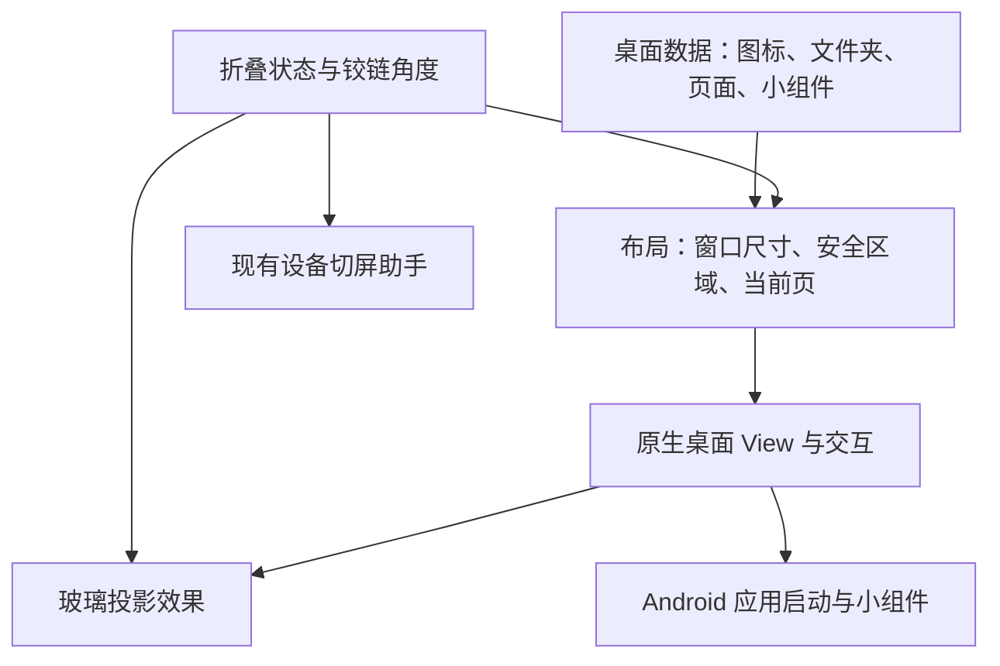

# iPhone Duo 桌面与交互扩展调研

调研日期：2026-09-14。代码基线：当前工作区 v0.4.29。目标按“在现有小米折叠屏上使用可操作的 Duo 风格 Android 桌面”理解。

本轮完成源码检查、Apple/Android 官方资料核对及仓库既有实机记录复核；没有新增实机测试，没有修改运行代码或安装 APK。以下区分官方能力、既有记录和工程建议，不把设计方案当作实测结果。

## 用户确认的范围与后续约束

以下为初次调研后确认的要求，优先于本文后面的初始探索建议：

- 实现可行的 Duo 风格桌面布局和桌面内交互，包括侧边 Dock、真实应用入口、分页、搜索、文件夹、排序和内外屏布局适配。
- 沿用现有小米小组件，不另造一套替代组件；优先验证实际组件的枚举、绑定、点击和持续刷新。
- 折叠投影与模糊保留项目当前能力和行为，不扩大为新的整屏变形设计。
- 小窗、分屏、跨应用返回动画与最近任务沿用小米原生；不实现 Duo 式拖边分屏或替代最近任务。
- 不改造第三方应用内部导航。
- 扩展屏与零黑帧放在最后独立研究，不因原生主屏交换路线的限制而提前排除固定拓扑、双输出的替代路线。

当前主要兼容问题：

1. 小米官方明确其小部件基于 Android Widget，因此存在直接承载基础；但曝光刷新、实时动态、组件中心等扩展依赖小米宿主协作。第三方桌面能显示某个组件，不等于所有增强功能自动完整可用。需逐个验证用户设备上的现有组件。[小米官方 FAQ](https://dev.mi.com/xiaomihyperos/documentation/detail?pId=1591)、[系统能力说明](https://dev.mi.com/xiaomihyperos/documentation/detail?pId=1584)
2. 保留原生系统功能仍需确认更换 HOME 后的集成行为。应用内/系统侧边栏入口，与依赖小米桌面的拖动入口、回图标落点，不应混为一谈。当前未实测这台 HyperOS 更换桌面后的手势、小窗、分屏和最近任务。
3. 扩展屏显示不同区域在自有桌面渲染层面可以设计；系统任务、触摸焦点、输入法、导航和锁屏仍有显示归属。此前固定主屏双屏输出记录为该方向提供了基础，但完整交互和动态分辨率尚未验证。此项按用户要求最后处理。

下一步验证顺序据此调整为：小米组件承载与原生导航兼容性 → Duo 桌面布局与交互 → 复用现有投影能力 → 扩展屏专项。若替换 Launcher 无法保留要求的原生体验，应重新评估集成路径，不能自行以仿制交互代替。

## 结论

可以扩展成真正的 Android Launcher：应用图标启动真实 Android 应用，桌面支持分页、文件夹、拖动、小组件和侧边 Dock，内外屏共用桌面数据，再与现有玻璃开合效果结合。基础桌面可以依靠公开 Android API；当前设备特定的切屏增强仍依赖已有 shell 助手。

推荐路线是“可选默认桌面 + 可复用折叠渲染核心”。这属于新建桌面子系统，并非给现有遮罩添加几个点击事件。系统级最近任务、全局返回动画、所有应用的侧边导航以及零黑帧主屏交换不属于普通 Launcher 自动获得的能力。

## 参考体验：哪些已确认

Apple 官方介绍确认：主屏幕 Dock 改到侧边；展开时并排显示主屏幕页面，左侧提供可纵向滚动的小组件 Today View；角落采用环形状态界面，灵动岛沿屏幕侧边纵向展开。以上适合作为桌面视觉目标。[Apple 发布说明](https://www.apple.com.cn/newsroom/2026/09/apple-unveils-iphone-duo/)

Apple 设计说明强调侧边控件、可调整尺寸、折叠姿态适应及 Split View；开发说明要求依据窗口尺寸与安全区域适配，避免为每个姿态硬编码一个布局。[设计说明](https://developer.apple.com/videos/play/tech-talks/111466/)、[应用适配说明](https://developer.apple.com/videos/play/tech-talks/111461/)

因此，本项目应复现布局关系与交互逻辑，再按小米实际屏幕比例调整密度和边距。精确图标行列数、翻页联动、拖拽阈值和动画曲线仍需逐项对照官方演示验证，本报告不将其写成已确认规格。

## 现有项目能复用什么

| 当前实现 | 复用价值与改造点 |
| --- | --- |
| `FoldPose`、角度跟随、闭合和平展保护 | 可作为桌面开合状态输入；需要从服务生命周期中抽出共享接口 |
| `ProjectionMath`、角度动画与 GPU 模糊 | 可复用数学和效果；“复用渲染器”不等于原样接入原生可交互 View |
| `MobileHelper` 和显示控制助手 | 保留设备适配、自定义切屏角度和兼容路径 |
| `DesktopActivity` | 实际是参数设置页；应新增桌面 Activity，而非把设置页直接当桌面 |
| `AndroidManifest.xml` | 现有入口只有 `MAIN/LAUNCHER`；`queries` 中的 HOME 只是查询声明，尚未注册 HOME 桌面入口 |
| `ProjectionService` | 连接时解析当前 HOME 包；桌面切换后需刷新，且同包设置页与桌面页不能只靠包名区分 |
| 当前投影覆盖层 | 使用 `FLAG_NOT_TOUCHABLE`，不负责图标点击、拖动或组件交互 |

源码入口：[清单](../projection-lab/src/main/AndroidManifest.xml)、[设置页](../projection-lab/src/main/java/io/github/sixzleo/tabfold/projection/DesktopActivity.java)、[服务](../projection-lab/src/main/java/io/github/sixzleo/tabfold/projection/ProjectionService.java)、[投影 View](../projection-lab/src/main/java/io/github/sixzleo/tabfold/projection/DesktopProjection.java)、[实时镜像助手](../tools/helpers/LiveMirrorWindowProbe.java)。

## 能力边界

| 目标 | 判断 | 实现或限制 |
| --- | --- | --- |
| 内屏小组件区、图标页、侧边 Dock | 可实现 | 原生布局；尺寸和点击区域随窗口变化 |
| 点击真实应用、搜索、分页、文件夹、拖动排序 | 可实现 | Launcher 数据模型、手势和应用启动 API |
| 标准 Android 小组件 | 可实现 | `AppWidgetHost` 管理绑定、配置、尺寸和生命周期；第三方内容不保证能换成统一玻璃样式 |
| 内外屏图标位置和页面记忆 | 可实现 | 共享条目 ID、当前页与布局配置；窗口重建时恢复状态 |
| 折叠时图标与组件一起投影 | 可实现，需专门渲染验证 | 桌面内容捕获/离屏绘制、效果处理与触摸映射必须一致 |
| 桌面内的环形电量、时钟和音乐卡片 | 可实现 | 自绘界面，逐项接真实数据；媒体和通知接入另做权限设计 |
| 跨应用纵向灵动岛、控制中心、锁屏 | 部分模拟，后续研究 | 桌面内仿制外观与全局替换 SystemUI 是不同范围 |
| 打开应用/返回图标的完整跟手动画 | 受系统集成限制 | 普通启动过渡可做；跨应用可交互动画和最近任务需系统协作 |
| 拖图标到边缘启动分屏 | 有公开入口，需实机验证 | 不等于能任意接管两个第三方应用的任务与窗口 |
| 将其他应用底部导航统一移到侧边 | Launcher 无法通用实现 | 需要对应应用本身适配 |
| 原生主屏交接全程零黑帧 | 当前不成立 | 既有记录表明主屏交换仍触发 OFF 与图层解绑 |

Android 提供 [`LauncherApps`](https://developer.android.com/reference/android/content/pm/LauncherApps?authuser=3) 和 [HOME 角色](https://developer.android.com/reference/android/app/role/RoleManager)，可作为默认桌面基础。小组件的绑定、配置及尺寸契约见 [AppWidgetHost 官方指南](https://developer.android.com/develop/ui/views/appwidgets/host)。

Android 12L 及以上允许全屏应用通过 `FLAG_ACTIVITY_LAUNCH_ADJACENT` 请求进入分屏并在邻侧启动目标。需要单独验证 Launcher 场景、小米任务策略、目标应用兼容性，以及失败时回退为正常启动。[多窗口指南](https://developer.android.com/develop/ui/views/layout/support-multi-window-mode)

AOSP Quickstep 声明了远程应用过渡、任务管理等权限，手势服务由 `STATUS_BAR_SERVICE` 保护。因此不能把“成为默认 HOME”视为“获得系统手势和最近任务的全部控制权”。AOSP 仅作架构参考，当前 HyperOS 的实际限制尚待验证。[Quickstep 清单](https://android.googlesource.com/platform/packages/apps/Launcher3/+/refs/heads/main/quickstep/AndroidManifest.xml)

## 推荐架构

建议先在现有项目增加独立 `DuoHomeActivity` 和桌面子包，保留设置入口。验证通过后再按依赖边界拆 Gradle 模块，避免最初同时迁移整个工程。

具体建议：

1. **共享数据、分别布局。** 内屏显示小组件区与图标区，外屏优先保留当前应用页与 Dock；这是首版建议，精确联动行为后续对照 Duo 演示调整。切屏保存页码、文件夹状态、滚动锚点和编辑状态，不依赖两块屏幕尺寸相同。
2. **先延续原生 Java/View 技术栈。** 小组件通过 `AppWidgetHostView` 承载。首轮可用现有镜像验证整体观感，随后研究直接处理自有桌面内容，减少对系统桌面重排时机的依赖。不要预先承诺全屏复杂模糊稳定 120 Hz。
3. **明确变形期间的触摸策略。** 原始坐标直接穿透会点错变形后的图标。首版可在开始操作时平滑收起效果；若要求变形中持续操作，应对触点做投影逆变换，处理多指、拖动、越界和小组件事件分发。仅修改绘制 shader 不够。
4. **折叠姿态与实时角度分开。** Jetpack WindowManager 可提供折叠特征和姿态，不能替代连续角度传感器；现有角度通道仍有价值。[Android 折叠感知指南](https://developer.android.com/develop/adaptive-apps/guides/foldables/make-your-app-fold-aware)
5. **提供独立的基础桌面运行路径。** 助手失联时仍可打开应用、翻页和显示组件；暂停玻璃效果不应让默认桌面失效。

## 与此前双屏研究的关系

仓库记录表明，固定逻辑主屏时已验证双屏输出；真正交换主屏会关屏。自有 Launcher 可以掌握源内容、布局和状态恢复，有望减少可见重排与等待，但无法让 OFF 面板继续发光。

也不能直接把双屏呈现理解成两个可独立操作的桌面：既有记录指出副屏 `canHostTasks=false`。固定主屏、另一屏镜像并转发触摸是另一项研究，还要处理应用任务、输入法和显示归属。

依据：[双屏实验记录](DUAL-DISPLAY-TRIAL.zh-CN.md)、[显示架构调研](DUAL-DISPLAY-RESEARCH.zh-CN.md)、[免 root 连续切换补充](NO-ROOT-DISPLAY-CONTINUITY.zh-CN.md)。这些是此前实验，本轮没有重做。

## 建议实施顺序与验收

| 阶段 | 交付 | 通过条件 |
| --- | --- | --- |
| 0：设备兼容验证 | 最小 HOME 原型、少量真实应用入口 | 可设置/退出默认桌面；Home、返回、最近任务及内外屏切换可用；记录系统手势是否受影响 |
| 1：可用桌面 | 双布局、侧边 Dock、应用列表/搜索、分页、持久化 | 真正启动应用并返回原页面；进程重建后布局仍在；助手关闭也能使用 |
| 2：编辑与组件 | 文件夹、跨页拖动、标准小组件及首批自绘卡片 | 拖动落点正确；组件可配置、点击、更新；折叠重建不丢 widget ID |
| 3：折叠整合 | 自有内容投影、反向开合和触摸策略 | 图标不误触、不重复叠加投影；快速反向和半折操作正常；测帧时间、温升、空闲功耗 |
| 4：系统增强探索 | 分屏入口、媒体/通知侧边交互、可行的应用过渡 | 逐项实机确认权限与回退；失败不阻断基本桌面 |

第一优先级是阶段 0，而非先画完整外观：它能最早确认这台 HyperOS 设备能否在用户期望的导航方式下日常使用第三方桌面。若系统手势或任务过渡受限，再决定接受系统过渡、适配助手，还是另立系统集成方案。

首版目标建议定为：**Duo 风格布局、真实应用和小组件、内外屏共享状态、已有玻璃开合效果**。完整桌面涉及持久化、应用更新/卸载、手势、小组件生命周期、进程恢复和系统适配，工作量明显超过一轮遮罩动画改动；具体工期应在阶段 0 结果出来后估算。
