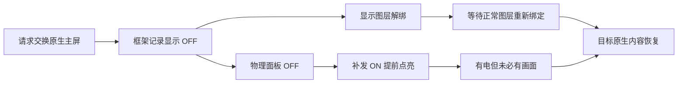

# 免 root 主屏连续切换补充研究

## 结论

在 `lhasa`、HyperOS `OS4.0.11.0.XPNCNXM`、Android 17 的现有 ADB shell 环境中，已经实测可以直接向物理内屏发送 ON，不需要 root。限时地在主屏交换窗口补发 ON，得到“黑屏缩短一点”的肉眼反馈，但系统的 OFF 指令仍然执行。这项能力是提前重新点亮，并非阻止关屏，也不是系统进程内拦截。[L1–L3]

本轮发现另一个独立的黑画面来源：框架将被判定为 OFF 的显示绑定到无内容的图层栈 `-1`。即使提前把面板点亮，画面也可能因图层解绑而继续为空。厂商的延迟设置图层逻辑仍保留这个空白分支。因此，“只拦截电源 OFF，就让桌面继续留在屏幕上”的系统修改设想也需要补上图层、亮度和切换完成条件处理，不能把单一方法拦截当成已完成方案。[L3–L5]

截至本轮结束，没有确认能在该固件上同时满足“免 root、原生主屏交接、全程零黑帧”的接口。现有证据支持继续优化重新点亮与显示内容恢复之间的间隔；它不支持承诺消除最初的物理 OFF。固定逻辑主屏、把输出和输入转到另一物理屏属于另一条架构路线，需要单独验收，不能冒充正常原生主屏交换。[L1–L6]

## 目标与实测基础

研究目标限定为保持现有系统、无需 root、保留原生桌面及应用交接，消除内外主屏交换时突然出现的黑屏。对象为同一台已授权无线调试的设备，检查时间为 2026 年 9 月 14 日。应用基线仍为 GlassProjection 0.3.43，生产助手资产和安装包未被替换。本轮使用独立 DEX 原型；没有修改系统分区、系统属性或启动配置。[L1、L2]

前置实测已建立三个事实。保持原主屏身份时，状态 5 或 6 可以让两块物理屏同时 ON；分别渲染实时模糊、视差时，肉眼确认跟手且没有闪黑。真正进行 `5↔6` 主屏交换时，两块物理显示会进入 OFF，肉眼确认会闪黑。两种结果对应不同的系统路径，不构成冲突。[L1]

完整历史和各轮采样见 [双屏原型实测](DUAL-DISPLAY-TRIAL.zh-CN.md)。本补充材料只讨论免 root 能力和新增证据，避免将初始接口推测与已执行结果混在一起。

## 实际可用权限与调用边界

运行时探针的身份为 UID 2000。下列结果来自实际 `Context.checkPermission()`，不是根据权限名称猜测。[L2]

| 能力 | 本机结果 | 对当前目标的意义 |
| --- | --- | --- |
| `CONTROL_DEVICE_STATE` | 已授予 | 可以请求已支持的双屏状态 |
| `MANAGE_DISPLAYS` | 已授予 | 可以调用部分系统显示管理方法 |
| `ACCESS_SURFACE_FLINGER` | 已授予 | 可到达部分合成器显示控制接口 |
| `DEVICE_POWER` | 已授予 | 不等于获得电源策略的永久优先权 |
| `INTERNAL_SYSTEM_WINDOW`、`CAPTURE_VIDEO_OUTPUT` | 已授予 | 支持先前已经验证的输出和采集路径 |
| `INJECT_EVENTS` | 已授予 | 为将来的输入转发研究提供条件，尚未测试交接中的输入正确性 |
| `ASSOCIATE_INPUT_DEVICE_TO_DISPLAY` | 已授予 | 输入关联 API 有研究价值，但不改变主屏交换的关屏逻辑 |
| `MONITOR_INPUT` | 未授予 | 不能假定现有助手可以任意监听全局触摸 |
| `MANAGE_VIRTUAL_DEVICE` | 未授予 | 不能把虚拟设备管理能力当成现成依赖 |

Shizuku 将调用放在已有 adb 或 root 身份的进程中执行，不会自动把 adb 身份提升为系统进程身份。Android 的进程隔离和 SELinux 也独立于“该功能只是动画”的用途判断。[P1、P2]

本机 `SurfaceControl` 仍公开反射可见的 `setDisplayPowerMode()`，但物理显示 token 获取方法已经迁至服务器库中的 `DisplayControl`。第一次探针沿用旧类路径，在实际电源调用前失败；调整到 Android 14+ 的类加载方式后，对已提交 ON 的主屏重复发送 ON，调用在约 0 ms 返回。随后主屏交换试验中的 SurfaceFlinger 日志进一步确认这些 ON 指令确实到达服务端。[L2、L3、P3]

这里加载服务器库发生在独立 shell 进程内，并没有注入或修改正在运行的 `system_server`。可以调用一个受现有权限允许的方法，与能够拦截另一个进程发出的调用，是两种能力。公开 scrcpy 的物理显示控制实现提供了相同 API 使用路径的交叉核对，不能据此推导出任意系统 Hook 能力。[P3]

## 补发 ON 的限时实机结果

试验在约 54°、外屏为主的姿态运行 20 秒。原型先请求状态 6，待双屏稳定后于第 6015 ms 请求状态 5；同时启动物理内屏 ON 工作线程，计划在 1.25 秒内最多调用 60 次。调用本身可能阻塞，因此这个时间窗口不是每次调用的硬超时。实际完成 23 次，其中一次耗时约 490 ms，另一次约 184 ms。[L3]

| 证据 | 观察结果 | 能够证明的范围 |
| --- | --- | --- |
| SurfaceFlinger 接受 ON | 在原 OFF 前后均有对应物理内屏的 ON 记录 | 免 root 直接亮屏调用可用 |
| SurfaceFlinger 接受 OFF | 单调时钟约 32935.909 s 记录内屏 OFF | 补发没有拦截原 OFF |
| 后续 ON | 约 32935.959 s 再次记录内屏 ON | 两条模式设置记录约相隔 50 ms；不是光学黑帧持续时间 |
| 图层事务 | 期间出现 `layerStackId=-1`，随后恢复为正常栈 | 电源恢复和显示内容恢复并非同一事件 |
| 框架状态 | 第 7012 ms 才再次读到两屏 committed ON | 请求到该状态约 997 ms |
| 肉眼反馈 | “确实缩短了一点” | 支持主观改善，尚无定量改善幅度 |

前一轮同方向对照从请求到两屏 committed ON 约 833 ms。本轮该指标反而较长，不应据此否定肉眼反馈，也不应把肉眼反馈换算成某个百分比提升。直接 ON 可能让内屏更早发光，同时与原有显示线程串行等待产生竞争；框架完成时间、单屏首个有效画面、面板黑帧时长必须分别测量。两次不同姿态的单次样本不足以得出性能分布。[L1、L3]

当前原型按固定间隔补发，目的是验证能力与机制，不适合直接作为生产策略。增大发送频率没有“提升命令优先级”的语义，也没有证据表明能让已经执行的 OFF 消失。正式的改善实验应减少无效调用、记录源帧与实际呈现状态，并比较重复样本。[L3、P4]

## 图层解绑为何会让已点亮屏幕仍然黑

本机 `DisplayManagerService.configureDisplayLocked()` 根据 `DisplayDeviceInfo.state == OFF` 传入 `isBlanked`。`LogicalDisplay.configureDisplayLocked()` 在空白状态选择图层栈 `-1`。此时普通桌面和位于它上方的动画层都不再是该物理显示所选图层栈的内容，提高层级不能解决这个绑定问题。[L4]

小米实现中存在 `isNeedDelaySetDisplayLayerStack()`：内部计数允许在显示身份和窗口覆盖信息尚未一致时推迟部分配置。然而进入该延迟分支后，如果 `isBlanked` 为真，代码仍显式绑定 `-1`。`resetCount()` 也只是内部计数操作，在已查的 Binder 分发入口中没有对应的“保持当前内容”会话。这条线不能作为现成的免 root 关屏拦截器。[L4、L5]

由此可见，未来系统级方案至少要协调电源、亮度、图层归属和完成条件。让上层记录 OFF、仅在下层跳过物理 OFF 的实验可能让原状态等待通过，但仍会遇到空白图层；它与完整、状态一致的系统连续切换方案有区别。当前没有在该手机上执行系统级修改。[L4、L5]

另一个可能设想是把覆盖层也放到 `-1` 栈，试图在系统 blank 时匹配它。公开 AOSP `LayerFilter.includes()` 明确排除 `INVALID_LAYER_STACK` 的输入图层，因此标准实现不支持这种做法。该源码用于排除缺乏依据的设计，不代表已经取得本机同版本 native 实现；本轮没有进行这种栈设置实验。[P5]

## 厂商和标准接口的核查结果

| 候选入口 | 核查结果 | 处置 |
| --- | --- | --- |
| `notifyScreenOffAnimatorEnd` | 只向显示控制器发送动画结束消息；主屏切换对应 `performScreenOffTransition=false` | 不能阻止切换 OFF，不继续实机滥发 |
| 小米预亮屏 `setPowerMode` | ON 分支要求不处于 `mIsInTransition`；保留早亮状态的 OFF 特判也要求非切换 | 排除作为切换保电锁 |
| `isNeedDelaySetDisplayLayerStack` | 延迟分支遇到 blank 仍绑定 `-1` | 排除作为保留旧图层开关 |
| `IDisplayManager.requestDisplayPower` / shell 显示电源命令 | 一次电源请求，沿用显示缓存及亮度；没有持续持有协议 | 与物理 ON 实验区分，不能解释为 OFF 拦截 |
| `IMiuiMultiDisplayManager.setDisplayStateIgnoreFold` | 已取 JAR 中只有接口声明；再次服务清单核查未发现对应可确认服务 | 保留为未证实线索，不假定可以调用 |
| `displayfeature` Java 服务 | 可取得正常接口描述符，已读调用链主要转发色彩、护眼、亮度、刷新率等特性 | 未识别出满足保电条件的有文档命令 |
| Xiaomi HWC 扩展、displayfeature HAL、XRing composer 扩展 | 服务名存在，但从该 shell 获取描述符为空；标准接口描述符查询发生 `DeadObjectException` | 不能把服务注册等同于调用成功；未发送未知配置命令 |
| 原生 SurfaceFlinger 电源 API | 对内屏 ON 调用已由实际服务端日志确认 | 可研究缩短空白，不能拦截系统 OFF |
| 输入关联 API | 方法可见，对应权限已授予 | 只为固定主屏的替代架构提供条件，不改变当前交换流程 |

HAL 的描述符查询失败后，检查到 composer、displayfeature 和 SurfaceFlinger 进程仍在运行，未观察到进程替换。异常本身不足以断言服务不存在或证明特定 SELinux 规则；应将其记录为当前客户端未获得可用调用契约，而非泛化成硬件绝无此能力。[L2、L6]

`displayfeature` 存在能转发到厂商实现的参数化接口，但参数名中的“省电”“AOD”“状态”不能证明可以阻止主屏交换 OFF。未取得同固件 native 参数语义和恢复协议前，不进行枚举命令号、随机试值或套用其他 SoC 的控制码。公开搜索中的同名接口没有找到可确认的厂商使用文档；这是本轮检索范围内的缺口，不是全网不存在的证明。[L5、L6]

## 可继续验证的免 root 路线

第一条是改善现有原生交换。利用已验证的物理 ON 接口提前恢复内屏，再单独研究在图层解绑阶段提供稳定过渡内容。只有当物理屏仍选中有效图层栈、亮度非零且有已提交缓冲区时，这个内容才可能显示；单纯创建更高层级窗口不足以满足条件。由于原 OFF 仍然存在，这条路线的验收目标应为缩短黑屏，而非直接承诺零黑帧。[L3–L5]

下一轮若测试直接维护物理显示的图层绑定，必须先实现独立的超时恢复：物理显示的图层栈修改不属于普通窗口，不能假定试验进程退出就会自动复原。还要按最新逻辑—物理映射恢复绑定，处理旋转、亮度和锁屏。当前实验只补发 ON，没有改写物理显示的图层绑定；这样的后续试验尚未实施。

第二条是固定逻辑主屏，将真实应用的显示输出和输入路由到另一物理屏，以避开触发 OFF 的主屏重映射。输入注入和输入关联权限是可用条件，但原生副屏仍被限制承载任务，应用可能继续按外屏姿态布局，安全画面、锁屏、输入法、导航栏和跨屏触控均需单独验证。这会改变交接架构，不能视为当前原生切换路径的简单修复。[L2、L4]

第三条是取得匹配固件的厂商连续切换接口。它能在不 root 的客户端中使用的前提，是系统服务本身已经支持受控调用，并且调用者具备被接受的权限或授权。现有证据尚未确认这样的入口。通过漏洞取得系统进程执行能力不属于现有 shell API 路线，本轮没有进行漏洞利用或系统进程注入。[P1、P2]

## 交付状态与验收限制

独立原型和能力探针位于 `tools/experiments/`，构建流程见该目录 README。Java 编译和 DEX 构建通过；`same-on` 与 `handoff-on` 已实机执行；后者按期停止工作线程、取消状态请求并恢复原助手。生产 APK、原助手 DEX 和用户设置未替换。

尚未完成独立过渡图层实验、定量高速摄影、重复开合统计、锁屏抢占、异常进程退出及不同固件兼容测试。现阶段应保留已验证的单屏兼容路径，不默认发布这项电源竞争实验。后续是否达到连续显示，应以两屏外部同步拍摄和源帧/呈现日志共同验收，不能只凭 committedState 或一次主观改善宣布完成。

## 来源与证据索引

本地材料对应同一台设备及同一固件，原始日志与系统文件保存在忽略目录，未随公开源码分发。时间值使用设备单调时钟或原型相对时间；两者在本文中分别标明。

| 编号 | 来源 | 定位与用途 |
| --- | --- | --- |
| L1 | `docs/DUAL-DISPLAY-TRIAL.zh-CN.md`；本地 `trial-handoff*.log` | 双屏动画、原生交换及肉眼结果 |
| L2 | `build/diagnostics/dual-display-research/noroot-capabilities.txt`、`noroot-descriptors.txt` | UID、实际权限、方法签名、服务描述符及 same-on 返回 |
| L3 | `build/diagnostics/dual-display-live/trial-handoff-on.log`、`trial-handoff-on-system.txt` | 23 次补发 ON、OFF/ON 顺序、图层事务、997 ms 框架观察值 |
| L4 | 本机 `services.jar` 反编译：`DisplayStateController.updateDisplayState`、`LogicalDisplayMapper.areAllTransitioningDisplaysOffLocked`、`DisplayManagerService.configureDisplayLocked`、`LogicalDisplay.configureDisplayLocked`、`LocalDisplayAdapter.LocalDisplayDevice.requestDisplayStateLocked` | OFF 等待、图层清空、物理调用与框架状态的先后关系 |
| L5 | 本机 `miui-services.jar` 反编译：`DisplayManagerServiceImpl.onTransact/isNeedDelaySetDisplayLayerStack`、`DisplayPowerControllerImpl.setWaitingScreenOffAnimator`、`DisplayFeatureManagerService.setDisplayFeature` | 厂商候选接口的实际语义 |
| L6 | `services-followup.txt`、`vendor-followup.txt`；`miui-framework.jar` 的 `IMiuiMultiDisplayManager` | 再次服务库存、运行时服务状态、仅有声明的接口 |

公开来源于 2026 年 9 月 14 日核查，源码分支会变化，不将公开 main/master 当成本机 native 二进制的完整实现。

- P1：RikkaApps，[Shizuku Introduction](https://shizuku.rikka.app/introduction/) 及 [Shizuku API README](https://github.com/RikkaApps/Shizuku-API/blob/master/README.md)，说明 shell/root 身份与调用边界。
- P2：Android Open Source Project，[Security-Enhanced Linux in Android](https://source.android.com/docs/security/features/selinux)，说明系统进程的强制访问控制。
- P3：Genymobile，[scrcpy DisplayControl wrapper](https://github.com/Genymobile/scrcpy/blob/master/server/src/main/java/com/genymobile/scrcpy/wrappers/DisplayControl.java) 及 [Device.setDisplayPower](https://github.com/Genymobile/scrcpy/blob/master/server/src/main/java/com/genymobile/scrcpy/device/Device.java)，交叉核对 Android 14+ 物理 token 获取和电源调用方法。
- P4：Android Open Source Project，[SurfaceFlinger.cpp](https://android.googlesource.com/platform/frameworks/native/+/refs/heads/main/services/surfaceflinger/SurfaceFlinger.cpp)，用于核对电源命令与权限检查的 API 语义，未用其替代本机 XRing 实现。
- P5：Android Open Source Project，[LayerStack.h，提交 6f3e1c008c](https://android.googlesource.com/platform/frameworks/native/+/6f3e1c008c/libs/ui/include/ui/LayerStack.h)，`LayerFilter.includes()` 对无效栈的过滤规则；固定公开提交，不冒充本机 native 版本。
